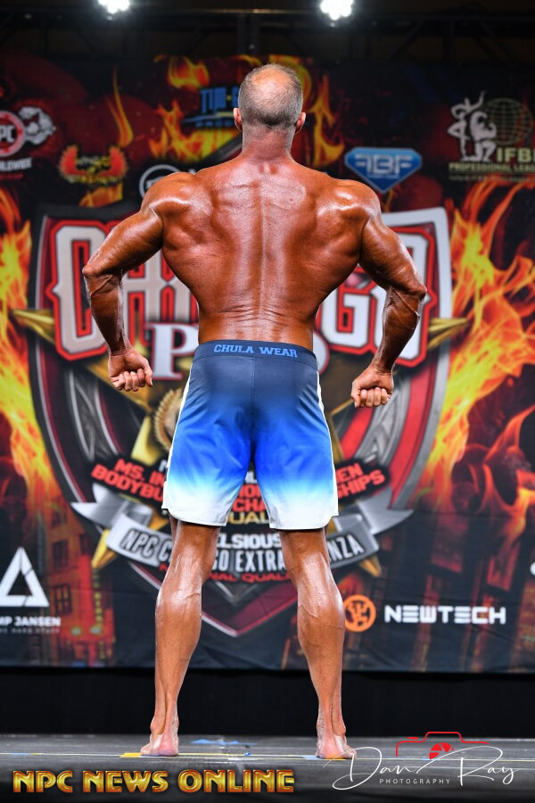
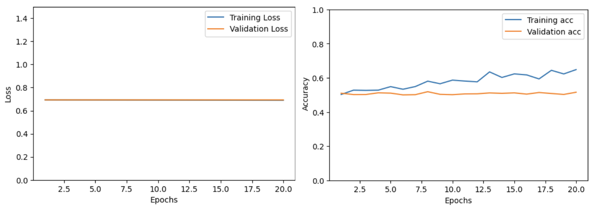
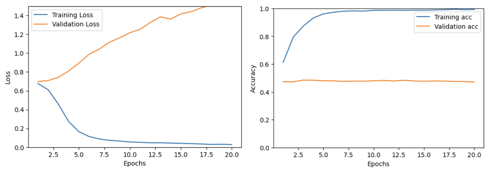

# Finding limits of deep learning with bodybuilder image comparison
--------------------
Erdos Institute Deep Learning Bootcamp

Fall 2024

- Luke Corwin
- David Osterman
- Andrei Prokhorov

--------------------

Creating a two-input convolutional neural network to decide the winner between two bodybuilder photos.

 

## Table of Contents
--------------------
- [Data Description](#data-description)
    - [Data scraping](#data-scraping)
    - [Data cleaning](#data-cleaning)
    - [Data processing](#data-processing)
- [Models](#models)
    - [Original two-input convolutional neural network](#Original-two-input-convolutional-neural-network)
    - [ResNet50-based](#ResNet50-based)
- [Results](#results)
    - [Model results](#model-results)
    - [Potential areas for improvement](#potential-areas-for-improvement)

## Data Description
-------------------
### Data scraping
Data consisted of photos from the [National Physique Committee website](https://contests.npcnewsonline.com/contests/2024). Photos were downloaded with the [data_scraping.ipynb](./notebooks/data_scraping.ipynb) Google Colab notebook.

Note: From now on all .ipynb notebooks were executed in Google Colab unless otherwise specified.

### Data cleaning
To reduce training time and needed model complexity, we focused on competitions from the `year` 2024 in the `division` 'Men’s Physique'. Within each competition, each contestant has a variable number of photos. We manually selected two photos, one front and one back, from each contestant using the [data_selection.ipynb](./notebooks/data_selection.ipynb) Jupyter notebook (note that Google Colab did not support the interactive feature of this notebook).

The .zip file of all selected photos can be downloaded [here](https://drive.google.com/file/d/1Wxj8rr-wImTTMaa-HPsHNAoyX4A9fqY0/view?usp=share_link).

Each competition also listed the final `rank` of the competitors from 1 up to 16. If more than 16 competitors were present, all after the first fifteen were tied at 16th place.

The training, validation, and test datasets were created using the [build_dataset.ipynb](./notebooks/build_dataset.ipynb) notebook. The purpose of our model was to compare an image from each of two competitors and decide a winner. Our dataset input `x` consisted of pairs of two photos, the front-facing photos from two different competitors, and our dataset `y` output consisted of an integer 0 (first competitor wins) or 1 (second competitor wins). Within each competition, we added a datapoint for each pair of competitors, using the rankings within the competition to determine if the winner should be 0 or 1. Two important nuances were:
- Each pair of competitors added *two* datapoints for each competitor pair, with the order of the competitors as competitor 0 or 1 reversed. This was to prevent the network's two image recognition parts from learning features of different competitors.
- If two competitors had the same ranking (eg. two competitors with ranking 16 or one competitor paired against himself) then the datapoint was thrown out.

We divided the data into [training](./data/df_train.pkl), [validation](./data/df_val.pkl), and [test](./data/df_test.pkl) sets, with a split of 65-18-17. The training set consisted of 11,776 image pairs with one-hot-coded labels. To keep the integrity of our validation and test sets, we kept competitions intact and ensured no competitor appeared in more than one of the three sets.

### Data processing
Processing was performed in the [neural_net_tuning_full_data.ipynb](./notebooks/neural_net_tuning_full_data.ipynb) notebook.

The data was formatted into an instance of a custom dataset we created, `CustomDataset(Dataset)`, a subclass of `torch.utils.data.Dataset`.

The photos, originally 600x900, were transformed to 128x128 using `torchvision.transforms.Resize()`.

## Models
-----------------------------------------
We employed two different models, an original two-input convolutional neural network and a ResNet50-based network.

### Original two-input convolutional neural network
Model creation and training were performed in the [neural_net_tuning_full_data.ipynb](./notebooks/neural_net_tuning_full_data.ipynb) notebook.

We first created an original model called `TwoInputNet(nn.Module)`, a subclass of `torch.nn.Module`. The architecture is the following:
- A sequential set of layers to learn features of the first input image. There were three convolution layers, each followed by a ReLU activation function and a 2D MaxPool. 
- A sequential set of layers to learn features of the second input image. It is identical to that of the first input image
- A sequential set of layers to combine the outputs from the two sets of convolutional layers. There was a linear layer, followed by a ReLU activation, followed by a linear layer with an output of size 1, and finally a sigmoid activation layer.

An output less than 0.5 was rounded down to 0 to indicate the first input image was the winner. An output greater than 0.5 was rounded up to 1 to indicate the second input image was the winner.

The network was trained for 20 epochs with 108 workers and a batch size of 256 on an A100 GPU in Google Colab. 

The trained original model can be downloaded [here](https://drive.google.com/file/d/1DcLbGghLwGnrHvBbwk280H4ggs9Ds-Dx/view?usp=share_link).

### ResNet50-based
The ResNet50-based model architecture was identical to that of our original model, except that the two sequential image-recognition parts were each replaced with ResNet50.

This network was also trained for 20 epochs with 108 workers and a batch size of 256 on an A100 GPU in Google Colab. 

The trained ResNet50-based model can be downloaded [here](https://drive.google.com/file/d/1ZE6lOn5-gIh-W04TuSNGLoAE-tnYNFl2/view?usp=share_link).

## Results
-----------------------------------------------------------------------------------------------------------------------

### Model results
We measured the loss and accuracy for the training and validation set for each epoch of training. Despite varying multiple hyperparameters, including learning rate and number of epochs, we were unsuccessful in validating either of the models. In every case, we found that either the model did not learn (training and validation loss functions remained flat)

or overfit (training loss function decreased while validation loss function increased.

### Potential areas for improvement
Potential improvements include  investigating the behavior of our models carefully and collecting more data from the NPC website to add more photo pairs. We think it might be useful to train a separate network to facilitate the photo selection process.
