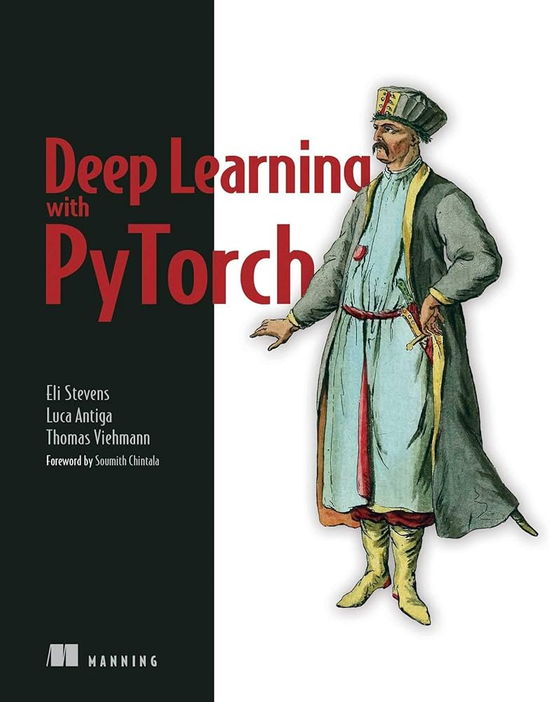

# References
## *Deep Learning with PyTorch* textbook
<kbd>
  
</kbd>
  
### Citation
Stevens, Eli, Luca Antiga, and Thomas Viehmann. *Deep learning with PyTorch*. Manning Publications, 2020.

## Data source
Bodybuilder images were scraped from NPC News Online (https://contests.npcnewsonline.com/contests/2024).
